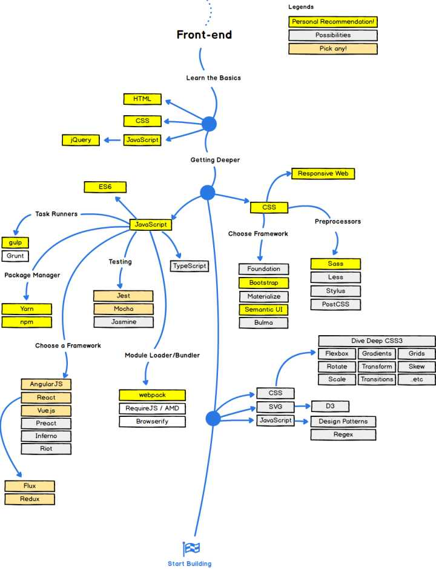

# Roadmap- front end

>图片来源：[2017年 Web 程序员技术发展路线图](https://zhuanlan.zhihu.com/p/25897612)

>[github源码](https://github.com/kamranahmedse/developer-roadmap)

## 参考阅读：

1. [Web前端开发大系概览 （前端开发技术栈）](https://www.cnblogs.com/unruledboy/p/WebFrontEndStack.html)  [github](https://github.com/unruledboy/WebFrontEndStack)
2. [21 步 教你成为一名成功的 Web 开发工程师](https://zhuanlan.zhihu.com/p/26680906)
3. [2017 年了，这么多前端框架，你会怎样选择？](https://zhuanlan.zhihu.com/p/28289441)
4. [知乎专栏-全栈成长之路](https://zhuanlan.zhihu.com/dingxuewen)
5. [2017 年比较 Angular、React、Vue 三剑客](https://zhuanlan.zhihu.com/p/31224434)
6. [【译】Angular vs React vs Vue](https://zhuanlan.zhihu.com/p/28349401)
7. [2018年前端开发工程师前景怎么样？](https://zhuanlan.zhihu.com/p/31630053)
8. [如何正确地总结 2016 前端技术？](https://www.zhihu.com/question/53705450)
